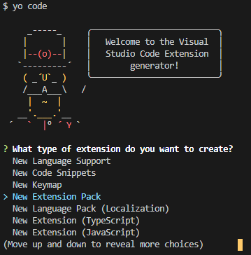
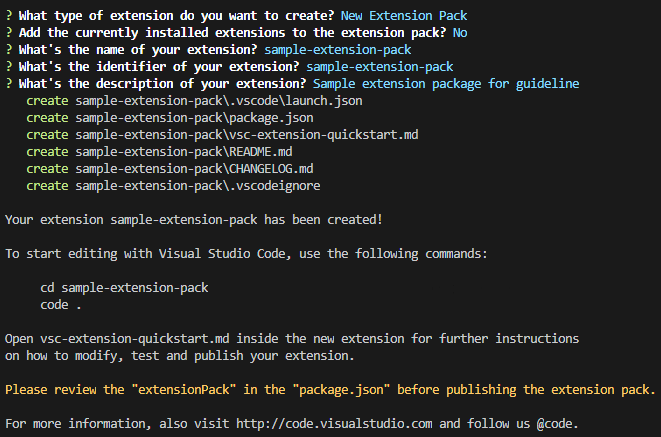

# How to create vscode extension pack guideline

## Table of Contents

- [How to create vscode extension pack guideline](#how-to-create-vscode-extension-pack-guideline)
  - [Table of Contents](#table-of-contents)
  - [Create extension](#create-extension)
    - [Install required packages](#install-required-packages)
    - [Scaffold extension](#scaffold-extension)
  - [Create vsix](#create-vsix)
  - [Publish extension :anchor:](#publish-extension-️)

## Create extension

### Install required packages

```console
npm install -g yo generator-code
```

- **yo**: Yeoman is a generic scaffolding system allowing the creation of any kind of app. [see documentation](https://yeoman.io/)

- **generator-code**: VS Code Extension generator [see documentation](https://github.com/Microsoft/vscode-generator-code)

### Scaffold extension

Execute code in terminal

```console
yo code
```





Sample _**package.json**_ file

```json
{
  "name": "${extension-pack-name}", //test
  "displayName": "webbranch-vscode-extension-pack",
  "description": "${description of extension pack}",
  "version": "0.0.1",
  "engines": {
    "vscode": "^1.45.0"
  },
  "categories": ["Extension Packs"],
  "extensionPack": ["publisher.extensionName"]
}
```

## Create vsix

```console
npm install -g vsce
vsce package
```

## Publish extension [:anchor:](#how-to-create-vscode-extension-pack-guideline)
