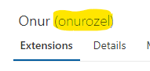

# Guideline | How to create vscode extension pack

This guideline is intended to how to create an visual studio code extension pack to wrap desired extensions in a single package.

## Create extension pack

### Install required packages

```console
npm install -g yo generator-code
```

- **yo**: Yeoman is a generic scaffolding system allowing the creation of any kind of app. [see documentation](https://yeoman.io/)

- **generator-code**: VS Code Extension generator [see documentation](https://github.com/Microsoft/vscode-generator-code)

### Scaffold extension pack

Execute `yo code` in terminal

Select **_New Extension Pack_** option


### Add desired extensions to **extensionPack** in **package.json** file

Eslint extension id: **_dbaeumer.vscode-eslint_**


Docker extension id: **_ms-azuretools.vscode-docker_**


```json
"extensionPack": [
        "dbaeumer.vscode-eslint",
        "ms-azuretools.vscode-docker"
    ]
```

### Add icon in **package.json** file

```json
"icon": "icon.png"
```

---

**NOTE**
Icon must be 128x128 pixel.

---

### Add publisher in **package.json** file

```json
"publisher": "onurozel"
```

### Add repository in **package.json** file

```json
"repository": {
        "type": "git",
        "url": "<GIT_URL>"
    }
```

## Create vsix file

Execute following commands to create vsix file.

```console
npm install -g vsce
vsce package
```

**sample-extension-pack-0.0.1.vsix** file is created.


## Publish extension

You will need a Microsoft account for this. You can create one [here](https://account.microsoft.com/account).

After that, you have to create a Microsoft account you need to navigate to the publishing management page. To get there click [here](https://marketplace.visualstudio.com/manage). There you need to create a new publisher if it's not created for you. You can find your publisher name from there.



This publisher name must be same publisher in package.json file.

Click new extension and select Visual studio code


Upload extension.


After verify you can search extension from vscode market place.


